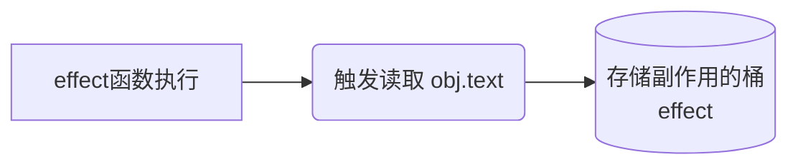
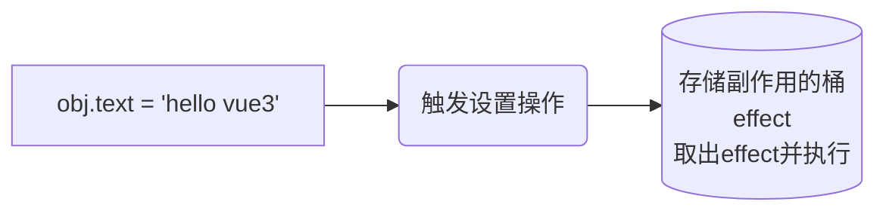
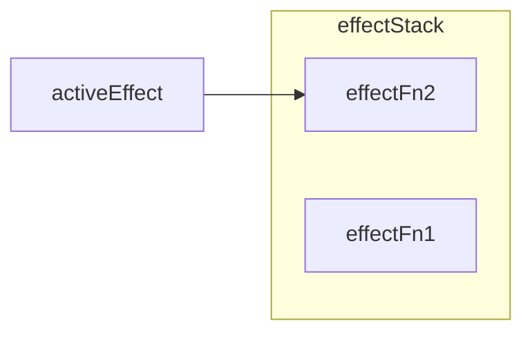
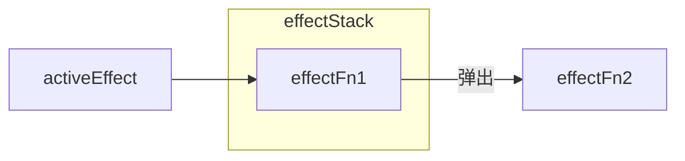

# 框架设计概览

## 第一章 权衡的艺术

### 1.1 命令式和声明式

视图层框架分为命令式和声明式，命令式框架的一大特点是关注过程，声明式更关注结果。

```js
// 命令式
$('#app') // 获取div
	.text('hello world') // 设置文本内容
	.on('click',() => { alert('OK') }) // 绑定点击事件
```

```html
// 声明式
<div @click="()=>alert('OK')">hello world</div>
```

Vue.js帮我们封装了过程，Vue.js内部实现一定是命令式的，而暴露给用户的却更加声明式。

### 1.2 性能与可维护性的权衡

声明式代码的性能不优于命令式代码的性能。声明式需要找到DOM变化的性能最小差异。

声明式代码的更新性能消耗 = 找出差异的性能消耗 + 直接修改的性能消耗

在采用命令式代码开发的时候，我们需要维护实现目标的整个过程，包括手动完成DOM元素的创建、更新和删除等。而声明式代码展示的就是我们要的结果，看上去更加直观，具体实现过程我们不用关心，因为Vue.js帮我们封装好了。
所以使用声明式框架的优点在于：在保持可维护性的同时让性能损失最小化。

### 1.3 虚拟DOM的性能到底如何

所谓虚拟DOM，就是为了最小化找出差异这一步的性能消耗而出现的。
涉及DOM的运算要比Javascript层面的计算性能差。

以通过innerHTML为例

创建情况下：
DOM操作性能 = 渲染HTML字符串 + 新建DOM元素
虚拟DOM性能 = 创建Javascript对象(VNode) + 新建DOM元素

更新情况下：
DOM操作性能 = 渲染HTML字符串 + 销毁旧DOM元素 + 新建DOM元素
虚拟DOM性能 = 创建Javascript对象+Diff + 必要的DOM更新

对于虚拟DOM来说，无论页面多大，都只会更新变化的内容，而对于innerHTML来说，页面越大，就意味着更新时的性能消耗越大。

| 性能差          |            | 性能好         |
| --------------- | ---------- | -------------- |
| innerHTML(模板) | 虚拟DOM    | 原生Javascript |
| 心智负担中等    | 心智负担小 | 心智负担大     |
| 性能差          | 性能不错   | 性能高         |
|                 | 可维护性强 | 可维护性差     |


### 1.4 运行时和编译时

设计一个Render函数来实现数据渲染成DOM元素

```js
const obj = {
  tag:'div',
  children:[
    {
      tag:'span',
      children:'hello world'
    }
  ]
}

function Render(obj, root) {
  const el = document.createElement(obj.tag)
  if (typeof obj.children === 'string') {
    const text = document.createElement(obj.children)
    el.appendChild(text)
  } else if (obj.children) {
    // 数组，递归调用Render，使用el作为root参数
    obj.children.forEach((child) => Render(child, el))
  }
  // 将元素添加到root
  root.appendChild(el)
}

// 渲染到body下
Render(obj, document.body)
```

这个Render函数就是纯运行时框架，这里面不涉及任何额外的步骤，用户也不用学习额外知识。但写树型结构的数据太麻烦了，能不能使用类似HTML标签的方式来描述树形结构呢？

这样就需要引入编译的手段，来实现HTML标签编译成树形结构，这样就能继续使用Render函数了。

```js
const html = `
<div>
  <span>hello world</span>
</div>
`
// 使用Compiler函数编译得到树形结构数据对象
const obj = Complier(html)
// 再调用Render进行渲染
Render(obj, document.body)
```

这样的我们的框架就是运行时+编译时框架了。但上面的代码是运行时编译的，会产生一定的性能开销。我们可以在构建时，将执行Compiler的内容先编译好，到运行时就无需编译了。

但既然把HTML编译成树型结构数据，为啥不直接编译成命令式代码(如下)？

```js
const div = document.createElement('div')
const span = document.createElement('span')
span.innerText = 'hello world'
div.appendChild(span)
document.body.appendChild(div)
```

这样就变成了一个纯编译时框架了。

运行时框架没有编译过程，无法分析用户内容。但加入编译步骤，就可以分析用户提供的内容在未来可能会改变，从传递给Render函数而进行优化。如果框架只是纯编译时，直接编译成可以执行的Javascript代码，性能可能会更好，但有损灵活性。


## 第二章 框架设计的核心要素

**提升用户体验**：在框架设计和开发过程中，提供友好的警告信息至关重要，不仅能够帮助用户快速定位问题，还能让用户认可框架的专业性。

### 2.2 控制框架代码体积

在实现同样代码的体积下，使用的代码越少越好，这样体积就会越小，最后浏览器加载资源的时间也就越少。

但提供越完善的警告信息就意味着我们要编写更多的代码，这就与控制代码体积相悖，从Vue.js 3的源码中，就能发现每个warn函数的调用都会配合`__DEV__`常量的检查：

```js
if(__DEV__ && !res) {
  warn(
  `Failed to mount app: mount target selector "${container}" returned null.`
  )
}
```

Vue.js使用 rollup.js 对项目进行构建，在输出资源时，会输出两个版本，开发环境和生产环境，当Vue.js构建用于开发环境资源时，会把`__DEV__`设置为 true，这样就能输出警告，在生产环境时`__DEV__` 设置为false，从而不会增加生产环境代码的体积。

### 2.3 Tree-Shaking

消除那些永远不会执行的代码，例如Vue.js内建了很多组件，如`<Transition>`组件，如果项目中根本没有用到该组件，则从中排除。
想要实现Tree-Shaking，必须满足一个条件，即模块必须是ESM(ES Module)，因为Tree-Shaking依赖ESM的静态结构。

```js
// demo文件夹格式
demo
	|— package.json
	|— input.js
	|— utils.js
	
// 安装 rollup.js
npm install rollup -D

// input.js
import { foo } from './utils.js'
foo()

// utils.js
export function foo(obj) {
	obj && obj.foo
}
export function bar(obj) {
  obj && obj.bar
}

// 然后执行 npx rollup input.js -f esm -o bundle.js
// bundle.js
function foo(obj) {
  obj && obj.foo
}
foo()
```

这里的 `bundle.js` 就不包含 `bar` 函数，因为 Tree-shaking 起了作用，因为我们没有使用到`bar`函数，因此它作为 dead code 删除了。
但仔细发现在，`foo`函数的执行也没有意义，仅仅是读取了对象的值，所以它的执行似乎没有什么必要，既然这段代码删了也不会对应用程序产生影响，那rollup.js 怎么没有删除呢？
这就涉及到Tree-Shaking的第二个关键点--副作用，如果一个函数调用会产生副作用，那么就不能将其移除。
如果obj 对象是通完 Proxy创建的代理对象，当读取obj属性时，会触发代理对象的get 夹子(trap)，在get 夹子 中是可能产生副作用的。例如在 get 夹子中修改了某个全局变量。因此到底会不会产生副作用，只有在代码真正运行的时候才能知道，而Javascript本身是动态语言，想要分析哪些代码是 dead code 很有难度的。

```js
// rollup.js 提供一个注释机制，告诉它这个代码是不会产生副作用的，可以Tree-Shaking
/*#__PURE__*/ foo()

// Vue.js 3 也大量使用了该注释，基本都是在一些顶级调用上使用，该注译可以应用于任何语句上
export const isHTMLTag = /*#__PURE*/ makeMap(HTML_TAGS)
```

通常产生副作用的代码都是顶级调用，但对于函数内调用，只要函数bar 没有被调用，foo函数的调用就自然不会产生副作用。

```js
// 顶级调用
foo()

function bar() {
	foo() // 函数内调用
}
```


### 2.4 框架应该输出怎样的构建产物

Vue 会为开发环境和生产环境输出不同的包，vue.global.js用于开发环境，vue.global.prod.js用于生产环境，不包含警告信息。vue.js 构建产物除了有环境上的区分之外，还会根据场景的不同输出其他形式的产物。

在HTML页面中使用 `<script>`标签引入框架，我们需要使用 IIFE（Immediately Invoked Function Expression 立即调用的函数表达式） 格式的资源

```js
(function (){
	//...
}())

// vue.global.js文件就是 IIFE 形式的资源
var Vue = (function(exports){
	//...
	exports.createApp = createApp;
	//...
	return exports
})
```

在 rollup.js 中，通过配置 `format: 'iife'`来输出这种形式的资源

```js
// rollup.config.js
const config = {
	input: 'input.js',
	output {
		file: 'output.js',
		format: 'iife' // 指定模块形式如 iife, esm, cjs
		}
}
```

Vue.js 3 还会输出 vue.esm-browser.js 文件，用户可以直接用 `<script type="module">`标签，原生ESM引入

```
<script type="module" src="/path/to/vue.esm-browser.js"></script>
```

输出 ESM 格式的资源。 rollup.js的输出格式需要配置为：`format:'esm'`

对于ESM格式资源，Vue.js 还会输出一个 vue.esm-bundler.js 文件，带有 -bundler字样的ESM资源是给 rollup.js或 webpack等打包工具使用的，而带有 -browser字样的ESM资源是直接给`<script type="module">`使用的。

提供给打包工具的ESM格式的资源，不能直接把`__DEV__`设置为true 或者 false，但是使用 `(process.env.NODE_ENV!=='production')` 替换 `__DEV__`常量，这样就可以让用户在打包工具中配置，决定构建资源的目标环境。

除了使用 `<script>`引入资源外，用户希望可以在Node.js中通过 require 语句引用资源，这样就可以进行服务端渲染。在Node.js环境中，资源的模块格式是Common.js ( cjs )，rollup.js的输出格式需要配置为：`format:'cjs'`

### 2.5 特性开关

特性开关的益处：

对于用户关闭的特性，利用 Tree-Shaking 机制让其不包含在最终的资源中
为框架添加新的特性，而不用担心资源体积变大
当框架升级时，通过特性开关来支持遗留 API，新用户可以选择不使用遗留 API，从而使最终打包的资源体积最小化

例如：
在 Vue.js 2 中，我们编写的组件叫作组件选项 API，在 Vue.js 3 中，推荐使用 Composition API 来编写代码
但是为了兼容 Vue.js 2，在 Vue.js 3 中仍然可以使用选项 API 的方式编写代码。如果确定不会使用选项 API，就可以使用`__VUE_OPTIONS_API__` 开关来关闭该特性，这样在打包的时候 Vue.js 的这部分代码就不会包含在最终的资源中，从而减小资源体积

### 2.6 错误处理

框架错误处理机制的好坏直接决定了用户应用程序的健壮性，还决定了用户开发时处理错误的心智负担

例如： utils.js是一个工具模块

```js
// utils.js 
// 该模块导出一个对象，其中 foo 属性是一个函数，接收一个回调函数作为参数，调用 foo 函数时会执行该回调函数
export default {
  foo(fn) {
  	fn && fn()
  }
}

// 使用
import utils from 'utils.js'
utils.foo(()=>{
  // ...
})
```

如果用户提供的回调函数在执行时出错了怎么办? 
方法一是用户自己在回调函数执行 try ... catch ...，但如果 utils.js有几十上百个类似的函数，那在使用时都要一个个加错误处理程序
方法二是我们代替用户统一处理错误，在utils.js 的每个函数内都增加 try... catch 代理块，还有更快的就是将错误处理程序封装成一个函数 `callWithErrorHanding`

```js
// 方法一
import utils from 'utils.js'
utils.foo(()=>{
	try{
    // ...
  } catch(e) {
    // ...
  }
})

// 方法二
export default {
  foo(fn) {
  	callWithErrorHanding(fn)
  }
}

function callWithErrorHanding(fn) {
  try{
    fn && fn()
  } catch (e) {
    console.log(e)
  }
}
```

还能为用户提供统一的错误处理接口

```js
let handleError = null
export default {
  foo(fn) {
  	callWithErrorHanding(fn)
  },
  // 用户可以调用该函数注册统一的错误处理函数
  registerErrorHandler(fu) {
  	handleError = fn
  }
}

function callWithErrorHanding(fn) {
  try{
    fn && fn()
  } catch (e) {
    // 将捕获到的错误传递给用户的错误处理程序
    handleError(e)
  }
}
```

用户可以使用 registerErrorHandler 函数注册错误处理程序，在 callWithErrorHanding 函数内捕获错误后，把错误传递给用户注册的错误处理程序，这样错误处理的能力就完全由用户控制，用户既可以选择忽略错误，也可以调用上报程序将错误上报给监控系统。
实际上，这就是Vue.js错误处理的原理，在源码中也能搜索到 callWithErrorHanding 函数。
在Vue.js 中，也可以注册统一的错误处理函数：

```js
import App from 'App.vue'
const app = createApp(App)
app.config.errorHander = () =>{
 // 错误处理程序
}
```


良好的 TypeScript 支持：在编写大型框架时，想要做到完善的TS类型支持很不容易，在Vue.js源码中 runtime-core/src/apDefineComponent.ts 文件里，真正在浏览器中运行的代码只有 3 行，全部的代码接近200行，都是为类型支持服务。 


## 第三章 Vue.js 3 的设计思路

### 3.1 声明式地描述UI

Vue.js 3支持使用模板来声明式地描述UI，还支持使用JS对象来描述

```js
const title = {
 // 标签名称
 tag:'h1',
 // 标签属性
 props: {
   onClick: handler
 },
 // 子节点
 children: [
   { tag: 'span' }
 ]
}
```

相对于使用模板，使用JS对象描述UI更加灵活，例如表示一个标题，根据标题级别的不同来分别使用 h1~h6 标签。

```js
// h 标签的级别
let level = 3
const title = {
  tag: `h${level}`, // h3标签
}
```

使用模板则只能：

```html
<h1 v-if="level === 1"></h1>
<h2 v-else-if="level === 2"></h2>
<h3 v-else-if="level === 3"></h3>
<h4 v-else-if="level === 4"></h4>
<h5 v-else-if="level === 5"></h5>
<h6 v-else-if="level === 6"></h6>
```

使用JS对象描述UI就是所谓的虚拟DOM，在Vue.js 3组件中手写渲染函数就是使用虚拟DOM来描述UI，如下：

```js
import { h } from 'vue'
export default {
  render() {
    return h('h1', { onClick: handler }) // 虚拟DOM
  }
}
```

以上是h函数的调用，使用h函数可以使我们编写虚拟DOM更加轻松（少写代码）。

一个组件要渲染的内容是通过渲染函数（render）来描述的，Vue.js会根据组件 render 函数的返回值拿到虚拟DOM，然后就可以把组件的内容渲染出来了。

### 3.2 初识渲染器

渲染器的作用就是把虚拟 DOM 渲染为真实 DOM。

手写一个简单渲染器，把虚拟 DOM 渲染为真实 DOM。

```js
// 虚拟DOM
const vnode = {
  tag:'div',
  props:{
    onClick: () => alert('hellow')
  },
  children: 'click me'
}

function renderer(vnode, container) {
  // 使用 vnode.tag 作为标签名创建 DOM 元素
  const el = document.createElement(vnode.tag)
  // 遍历 vnode.props，将属性、事件添加到 DOM 元素
	for(const key in vnode.prods){
    if(/^on/.test(key)){
      // 如果key 以 on 开头，说明它是事件
      el.addEventListener(
        key.substr(2).toLowerCase(), // 事件名称 onClick -> click
        vnode.props[key] // 事件处理函数
      )
    }
  }
  // 处理children
  if(typeof vnode.children === 'string') {
    // 如果 children 是字符串，说明它是元素的文本子节点
    el.appendChild(document.createTextNode(vnode.children))
  }else if(Array.isArray(vnode.children)) {
    // 递归调用 renderer 函数渲染子节点，使用当前元素 el 作为挂载点
    vnode.children.forEach(child => renderer(child, el))
  }
  // 将元素添加到挂载点下
  container.appendChild(el)
}

// 调用 renderer 函数， body作为挂载点
renderer(vnode, document.body)
```

总体实现步骤可以分为三步：

- 创建元素：把 vnode.tag 作为标签名称来创建 DOM 元素。
- 为元素添加属性和事件：遍历 vnode.props 对象，如果 key 以 on 字符开头，说明它是一个事件，把字符 on 截取掉后再调用 toLowerCase 函数将事件名称小写化，最终得到合法的事件名称，例如 onClick 会变成 click，最后调用 addEventListener 绑定事件处理函数。
- 处理 children：如果 children 是一个数组，就递归地调用 renderer 继续渲染，注意，此时要把刚刚创建的元素作为挂载点（父节点）；如果 children 是字符串，则使用 createTextNode 函数创建一个文本节点，并将其添加到新创建的元素内。

### 3.3 组件的本质

组件的本质就是一组 DOM 元素的封装。

定义一个函数来代表组件：

```js
const MyComponent = function () {
	return {
		tag: 'div',
		props: {
			onClick: () => alert('hello')
		},
		children: 'click me'
	}
}
const vnode = {
  tag: MyComponent
}
```

可以看出组件的返回值也是虚拟DOM。

修改renderer函数来能够渲染组件：

```js
function renderer(vnode, container) {
  if(typeof vnode.tag === 'string') {
    // vnode 描述的是标签元素
    mountElement(vnode, container)
  } else if (typeof vnode.tag === 'function') {
    // vnode 描述的是组件
    mountComponent(vnode, container)
  }
}

function mountElement(vnode, container) {
   // 使用 vnode.tag 作为标签名创建 DOM 元素
  const el = document.createElement(vnode.tag)
  // 遍历 vnode.props，将属性、事件添加到 DOM 元素
	for(const key in vnode.prods){
    if(/^on/.test(key)){
      // 如果key 以 on 开头，说明它是事件
      el.addEventListener(
        key.substr(2).toLowerCase(), // 事件名称 onClick -> click
        vnode.props[key] // 事件处理函数
      )
    }
  }
  // 处理children
  if(typeof vnode.children === 'string') {
    // 如果 children 是字符串，说明它是元素的文本子节点
    el.appendChild(document.createTextNode(vnode.children))
  }else if(Array.isArray(vnode.children)) {
    // 递归调用 renderer 函数渲染子节点，使用当前元素 el 作为挂载点
    vnode.children.forEach(child => renderer(child, el))
  }
  // 将元素添加到挂载点下
  container.appendChild(el)
}

function mountComponent(vnode, container) {
  // 调用组件函数，获取组件要渲染的内容（虚拟DOM）
  const subtree = vnode.tag()
  // 递归调用 rendere 渲染 subtree
  renderer(subtree,container)
}
```

当然，组件也可以是个对象：

```js
// MyComponent 是一个对象
const MyComponent = {
  render() {
    return {
      tag: 'div',
      props:  {
        onClick: () => alert('Hello')
      },
      children: 'click me'
    }
  }
}
```

这样就需要修改渲染器的判断条件：

```js
function renderer(vnode, container) {
  if(typeof vnode.tag === 'string') {
    mountElement(vnode, container)
  }else if (typeof vnode.tag === 'object') {
    // 如果为对象，则vnode 描述的是组件
    mountComponent(vnode, container)
  }
}
```

再修改 mountComponent 函数

```js
function mountComponent (vnode, container) {
  // vnode.tag 是组件对象，调用它的render 函数得到组件要渲染的内容 (虚拟DOM)
  const subtree = vnode.tag.render()
  // 递归调用 renderer 渲染 subtree
  renderer(subtree, container)
}
```


### 3.4 模板的工作原理

手写虚拟DOM和模板都属于声明式的描述UI。模板工作原则是通过编译器将模板编译为渲染函数。

例如：

```html
<div @click="handler">
	click me
</div>
```

对于编译器来说，模板就是普通的字符串，它会分析该字符串并生成一个功能与之相同的渲染函数：

```js
render(){
  return h('div', {onClick: handler}, 'click me')
}
```

以 `.vue`文件为例，一个`.vue`文件就是一个组件：

```vue
<template>
	<div @click="handler">
    click me
   </div>
</template>

<script>
export default {
  data() {/*...*/},
  methods: {
    handler: ()=>{/*...*/}
  }
}
</script>
```

其中 `<template>`标签里的内容就是模板内容，编译器把模板内容编译成渲染函数并添加到 `<script>`标签块的组件对象上，最终在浏览器里运行的代码就是：

```js
export default {
  data() {/*...*/},
  methods: {
    handler: () => {/*...*/}
  },
  render() {
    return h('div', { onClick: handler }, 'click me')
  }
}
```

无论是手写渲染函数还是模板，对于一个组件来说，它要渲染的内容最终都是通过渲染函数产生的，然后渲染器再把渲染函数返回的虚拟DOM渲染为真实的DOM，这就是模板的工作原理，也是`Vue.js`渲染页面的过程。


### 3.5 Vue.js 是各个模块组成的有机整体

例如：

```html
<div id="foo" :class="cls"></div>
```

编译器把这段代码编译成渲染函数：

```js
render() {
	// return h('div', { id: 'foo', class: cls })
	return {
		tag: 'div',
		props: {
			id: 'foo',
			class: cls
		}
	}
}
```

上面的代码可以看到 cls是一个变量，所以当cls 的值发生变化时，渲染器会自动寻找变更点。
但渲染器“寻找”这个变化很费力，但从编译器的方向来看，如果编译器有能力分析动态内容，并在编译阶段把这些信息提取出来，然后直接交到渲染器，这样就不需要渲染器去寻找变更点了。

从上面的模板可以看到， `id="foo"`是永远不会变化的，而`:class="cls"`是一个`v-bind`绑定，它是可能发生变化的，所以编译器能识别出哪些是静态属性，哪些是动态属性，在生成代码的时候完全可以附带这些信息：

```js
render() {
	return {
    tag: 'div',
    props: {
      id: 'foo',
      class: cls
    },
    patchFlags: 1 // 假设数字 1 代表 class是动态的
  }
}
```

这样渲染器就知道 `class`属性会发生改变，省去寻找变更点的工作量，性能自然就提升了。

编译器和渲染器之间是存在信息交流的，它们互相配合使得性能进一步提升。 


## 第四章 响应系统的作用与实现

### 4.1 响应式数据与副作用函数

副作用函数：

```js
function effect() {
  document.body.innerText = 'hello vue3'
}
```

当 effect 函数执行时，它会设置 body 的文本内容，但除了effect 函数之外的任何函数都可以读取或设置 body 的文本内容。也就是说，effect 函数的执行会直接或间接影响其他函数的执行，这时我们说 effect 函数产生了副作用。副作用很容易产生，例如一个函数修改了全局变量，这其实也是一个副作用。

```js
let val = 1 // 全局变量
function effect() {
	val = 2 // 修改全局变量，产生副作用
}
```

响应式数据：

```js
const obj = { text: 'hello vue3' }
function effect() {
	document.body.innerText = obj.text
}
```

副作用函数 effect 会设置 body 元素的innerText 属性，其值为 obj.text，当 obj.text 的值发生变化时，希望副作用函数 effect 会重新执行。

```js
obj.text = 'hello world' // 修改obj.text值，同时希望副作用函数重新执行
```

因为obj是一个普通对象，当修改它的值时，除了值本身发生变化之外，不会有任何其它反应。


### 4.2 响应式数据的基本实现

让 obj 变成响应式数据，当副作用函数 effect 执行时，会触发字段 obj.text 的读取操作。 当修改 obj.text 的值时，会触发字段 obj.text 的设置操作。

当读取字段 obj.text 时，我们可以把副作用函数 effect 存储到一个“桶”里。




当设置 obj.text 时，再把副作用函数 effect 从“桶”里取出并执行即可。



如何才能拦截一个对象属性的读取和设置操作？

在ES2015之前，只能通过 `Object.defineProperty` 函数实现，这也是Vue.js 2采用的方式。

在ES2015+ 中，可以使用代理对象 Proxy 来实现，这也是Vue.js 3采用的方式。

```js
// 存储副作用函数的桶
const bucket = new Set()

// 原始数据
const data = { text: 'hello world' }
// 对原始数据的代理
const obj = new Proxy(data, {
  // 拦截读取操作
  get(target, key) {
    // 将副作用函数 effect 添加存储副作用函数的桶中
    bucket.add(effect)
    // 返回属性值
    return target[key]
  },
  // 拦截设置操作
  set(target, key, newVal) {
    // 设置属性值
    target[key] = newVal
    // 把副作用函数从桶里取出并执行
    bucket.forEach(fn=>fn())
    // 返回 true代表设置操作成功
    return true
  }
})
```

测试一下：

```js
// 副作用函数
function effect() {
  document.body.innerText = obj.text
}
// 执行副作用函数，触发读取
effect()
// 1 秒后修改响应式数据
setTimeout(()=>{
  obj.text = 'hello vue3' 
}, 1000)
```

在浏览器中运行上面的代码，会得到期望的结果。

但目前的实现还有很多问题，如直接名字来获取副作用函数，这样硬编码很不灵活，副作用函数的名字可以任意取，甚至是一个匿名函数，因此要想办法不用这种硬编码。

### 4.3 设计一个完善的响应系统

现在来完善上面的响应系统，首先提供一个用来注册副作用函数的机制：

```js
// 用一个全局变量存储被注册的副作用函数
let activeEffect
// effect 函数用于i也没毛病副作用函数
function effect(fn) {
  // 当调用 effect 注册副作用函数时，将副作用函数 fn 赋值给 activeEffect
  activeEffect = fn
  // 执行副作用函数
  fn()
}
```

```js
// 使用 effect 函数
effect(
	// 一个匿名的副作用函数
	()=>{
		document.body.innerText = obj.text
	}
)
```

当 effect 函数执行时， 会把匿名的副作用函数 fn 赋值给全局变量 activeEffect，然后执行 fn 函数，这将会触发响应式数据  obj.text 的读取操作，进面触发代理对象 Proxy 的 get 拦截函数。

```js
const obj = new Proxy(data, {
  get(target, key) {
    // 将activeEffect 中存储的副作用函数收集到桶中
    if(activeEffect) {
      bucket.add(activeEffect) // 新增
    }
    return target[key]
  },
  set(target, key, newVal) {
    target[key] = newVal
    bucket.forEach(fn => fn())
    return true
  }
})
```

对这系统稍加测试，在响应式数据 obj 上设置一个不存在的属性时：

```js
effect(
	// 匿名副作用函数
  () => {
 		console.log('effect run') // 会打印两次
    document.body.innerText = obj.text
  }
)

setTimeout(()=>{
  // 副作用函数中并没有读取 notExist 属性的值
  obj.notExist = 'hello vue3'
})
```

当上面的代码执行时，'effect run' 会执行两次，因为是使用一个Set数据结构作为存储副作用函数的“桶”，没有在副作用函数与被操作的目标字段之间建立明确的联系。例如当读取属性时，无论读取哪个属性，都会把副作用函数收集到桶里；当设置属性时，无论设置哪个属性，也都会把桶里的副作用函数取出执行。解决方法就是在副作用函数与被操作字段之间建立联系即可，这就需要重新设置“桶”的数据结构。

如何设计？

```js
effect(function effectFn(){
	document.body.innerText = obj.text
})
```

在这段代码中存在三个角色：

- 被操作（读取）的代理对象 obj；
- 被操作（读取）的字段名 text；
- 使用 effect 函数注册的副作用函数 effectFn；

用 target 来表示一个代理对象所代理的原始对象，用key 来表示被操作的字段名，用 effectFn 来表示被注册的副作用函数，那么可以为这三个角色建立如下关系：

```
target
     └── key
         └── effectFn
```

结构就像这样：

```js
effect(function effectFn1() {
  obj1.text
})
effect(function effectFn2() {
  obj1.text1
})
effect(function effectFn3() {
  obj2.text2
})
// 结构关系如下
target1
    └── text
        └── effectFn1
    └── text1
        └── effectFn2
target2
    └── text2
        └── effectFn3
```

代码实现桶的数据结构：

```js
// 存储副作用函数的桶
const bucket = new WeakMap()

// 修改 get/set 拦截器代码
const obj = new Proxy(data, {
  // 拦截读取操作
  get(target, key) {
    // 没有activeEffect, 直接return
    if(!activeEffect) return target[key]
    // 根据 target 从“桶” 中取得 depsMap, 它也是一个 Map 类型： key--> effects
    let depsMap = bucket.get(target)
    // 如果不存在 depsMap, 那么新建一个 Map 并与 target 关联
    if(!depsMap) {
      bucket.set(target, (depsMap = new Map()))
    }
    // 再根据 key 从 depsMap 中取得 deps, 它是一个 Set 类型
    // 里面存储着所有当前 key 相关联的副作用函数： effects
    let deps = depsMap.get(key)
    // 如果 deps 不存在， 同样新建一个 Set 并与 key 关联
    if(!deps) {
      depsMap.set(key, (deps = new Set()))
    }
    // 最后将当前激活的副作用函数添加到“桶”里
    deps.add(activeEffect)
    // 返回属性值
    return target[key]
  },
  // 拦截设置操作
  set(target, key, newVal) {
    // 设置属性值
    target[key] = newVal
    // 根据 target 从桶中取得 depsMap, 它是 key --> effects
    const depsMap = bucket.get(target)
    if(!depsMap) return
    // 根据 key 取得所有副作用函数 effects
    const effects = depsMap.get(key)
    // 执行副作用函数
    effects && effects.forEach(fn=>fn())
  }
})

```

从这段代码可以看出构建数据结构的方式，分别使用了WeakMap、Map 和 Set：

- WeakMap 由 target --> Map 构成
- Map 由 key --> Set 构成

 * WeakMap 是用来存储响应式对象的, WeakMap 的key是弱引用，当target没有任何引用时 说明用户侧不再需要它，则进行垃圾回收
 * Map 用于存储响应式对象下的key 例如 obj = {text:'123'}  中的 text
 * Set 则是存储key对应的副作用函数 effect （key 的依赖合集）

WeakMap 和 Map 的区别：

```js
const map = new Map();
const weakmap = new WeakMap();
(function(){
   const foo = {foo: 1};
   const bar = {bar: 2};
  
   map.set(foo, 1);
   weakmap.set(bar, 2);
})()
```

这里定义了一个IIFE，当函数表达式执行完毕后，对象 foo 它仍然作为 map 的 key 被引用着，因此垃圾回收器 (grabage collector) 不会把它从内存中移除，仍然可以通过 map.keys 打印出对象 foo 。而对象 bar 就会被垃圾回收器从内存中移除，因为 WeakMap 的 key 是弱引用，从而无法获取  weakmap 的 key 值，也就无法通过 weakmap 取得对象 bar 。

再对拦截函数的逻辑封装（track：跟踪；trigger：触发），提高灵活性：

```js
const obj = new Proxy(data, {
  // 拦截读取操作
  get(target, key) {
    // 将副作用函数activeEffect 添加到存储副作用函数的桶中
    track(target, key)
    // 返回属性值
    return target[key]
  },
  // 拦截设置操作
  set(target, key, newVal) {
    // 设置属性值
    target[key] = newVal
    // 把副作用函数从桶里取出并执行
    trigger(target, key)
  }
})

// 在 get 拦截函数内调用 track 函数追踪变化
function track(target, key) {
  // 没有 active Effect，直接 return 
  if(!activeEffect) return
  let depsMap = bucket.get(target)
  if(!depsMap) {
    bucket.set(target, (depsMap = new Map()))
  }
  let deps = depsMap.get(key)
  if(!deps) {
    depsMap.set(key, (deps = new Set()))
  }
  deps.add(activeEffect)
}

// 在 set 拦截函数内调用 trigger 函数触发变化
function trigger(target, key) {
  const depsMap = bucket.get(target)
  if(!depsMap) return
  const effects = depsMap.get(key)
  effects && effects.forEach(fn => fn())
}

```

 

### 4.4 分支切换与 cleanup

```js
const data = { ok:true, text: 'hello world' }
const obj = new Proxy(data, {/*...*/})

effect(function effectFn() {
  document.body.innerText = obj.ok ? obj.text : 'not'
})
```

在 effectFn 函数内部存在一个三元表达式，根据字段 obj.ok 值的不同会执行不同的代码分支。当字段 obj.ok 的值发生变化时，代码执行的分支会跟着变化，这就是所谓的分支切换。

分支切换可能会产生遗留的副作用函数。比如，obj.ok 的初始值为 true，这时会读取 obj.text 的值，所以当 effectFn 函数执行时会触发 obj.ok 和 obj.text 这两个属性的读取操作，此时副作用函数 effectFn 与响应式数据之间建立的联系如下：

```
data
    └── ok
        └── effectFn
    └── text
        └── effectFn
```

副作用函数 effectFn 分别被字段 data.ok 和字段 data.text 所对应的依赖集合收集，当字段 obj.ok 的值修改为false，并触发副作用函数重新执行后，由于此时字段 obj.text 不会被读取，只会触发字段 obj.ok 的读取操作，所以理想情况下副作用函数 effectFn 不应该被字段 obj.text 所对应的依赖集合收集。但按照前文的实现，还做不到这一点。当 obj.ok 修改为 false 时，整个依赖关系还是不变，这时就产生了遗留的副作用函数。

obj.ok 的初始值为 true，当将其修改为 false 后，所以不再会读取字段 obj.text 的值。无论 obj.text 的值如何改变，document.body.innerText 的值始终都是字符串 'not' ，此时修改 obj.text的值，仍然会导致副作用函数重新执行，即使 document.body.innerText 的值不需要变化。 

解决方法：每次副作函数执行前，先把它从所有与之关联的依赖集合中删除，当副作用函数执行完毕后，会重新建立联系，但在新的联系中不会包含遗留的副作用函数。

```
data
    └── ok
        └── effectFn（删除）
    └── text
        └── effectFn（删除）
```

要将一个副作用函数从所有与之关联的依赖集合中移除，就需要明确知道哪些依赖集合中包含它，因此我们需要重新设计副作用函数：

```js
// 用一个全局变量存储被注册的副作用函数
let activeEffect
function effect(fn) {
  const effectFn = () =>{
    // 调用 cleanup 函数完成清除工作
    cleanup(effectFn)
    // 当 effectFn 执行时，将其设置为当前激活的副作用函数
    activeEffect = effectFn
    fn()
  }
  // activeEffect.deps 用来存储所有与该副作用函数相关联的依赖集合
  effectFn.deps = []
  // 执行副作用函数
  effectFn()
}
```

在 track 函数中实现 effectFn.deps 的依赖收集

```js
function track(target, key) {
	// 没有activeEffect，直接 return
	if(!activeEffect) return
  let depsMap = bucket.get(target)
  if(!depsMap) {
    bucket.set(target, (depsMap = new Map()))
  }
  let deps = depsMap.get(key)
  if(!deps) {
    depsMap.set(key, (deps = new Set()))
  }
  // 把当前激活的副作用函数添加到依赖集合 deps 中
  deps.add(activeEffect)
  // deps 就是一个与当前副作用函数存在联系的依赖集合
  // 将其添加到 activeEffect.deps 数组中
  activeEffect.deps.push(deps) // 新增
}
```

```js
function cleanup(effectFn) {
  // 遍历 effectFn.deps 数组
  for (let i  = 0; i < effectFn.deps.length; i++) {
    // deps 是依赖集合
    const deps = effectFn.deps[i]
    // 将 effectFn 从依赖集合中移除
    deps.delete(effectFn)
  }
  // 最后需要重置 effectFn.deps 数组
  effectFn.deps.length = 0
}
```

cleanup 函数接收副作用函数作为参数，遍历副作用函数的effectFn.deps 数组，该数组的每一项都是一个依赖集合，然后将该副作用函数从依赖集合中移除，最后重置effectFn.deps 数组。

现在响应系统可以避免副作用函数产生遗留了。运行代码后，会发现目前的实现会导致无限循环执行，问题出在 trigger 函数中：

```js
function trigger(target, key) {
  const depsMap = bucket.get(target)
  if (!depsMap) return
  const effects = depsMap.get(key)
  effects && effects.forEach(fn => fn()) // 问题出在这句代码
}
```

在 trigger 函数内部，遍历 effects 集合，它是一个 Set 集合，里面存储着副作用函数。当副作用函数执行时，会调用cleanup 进行清除，实际上就是从 effects 集合中将当前执行的副作用函数剔除，但是副作用函数的执行会导致其重新被收集到集合中，而此时对于 effects 集合的遍历仍在进行。

语言规范中对此有明确的说明：在调用 forEach 遍历 Set 集合时，如果一个值已经被访问过了，但该值被删除并重新添加到集合，如果此时 forEach 遍历没有结束，那么该值会重新被访问。
所以上面的代码会无限执行。解决办法就是可以构造另外一个 Set 集合并遍历它：

```js
function trigger(target, key) {
	const depsMap = bucket.get(target)
  if(!depsMap) return
  const effects = depsMap.get(key)
  const effectsToRun = new Set(effects) // 构造 effectsToRun 集合并遍历它，代替直接遍历 effects 集合
  effectsToRun.forEach(effectFn => effectFn())
}
```


### 4.5 嵌套的 effect 与 effect 栈

```js
effect(function effectFn1() {
	effect(function effectFn2() {
    // do sth ...
  })
  // do sth ...
})
```

代码中 effectFn1 中嵌套了 effectFn2，effectFn1 的执行会导致 effectFn2的执行。

当一个组件中渲染了另一个组件时，就发生了 effect 嵌套。但前文中的实现是不支持 effect 嵌套的。

```js
// 全局变量
let temp1, temp2

effect(() => {
  console.log('effectFn1 run')
  effect(()=>{
    console.log('effectFn2 run')
    // 在effect2 中读取 obj.bar 
    temp2 = obj.bar
  })
  // 在effect1 中读取 obj.foo 
  temp1 = obj.foo
})
obj.foo = false // 期望: effectFn1 执行后 effectFn2 也执行，现实是只执行了 effectFn2
// 打印结果
// effectFn1 run
// effectFn2 run
// effectFn2 run
```

前两次分别是副作用函数 effectFn1 与 effectFn2 初始执行的打印结果。第3次居然打印了 effect2，显示不符合预期。

问题就出现在 effect 函数
```js
// 用一个全局变量存储当前激活的 effect 函数
let activeEffect
function effect(fn) {
  const effectFn = () => {
    cleanup(effectFn)
    // 当 effect 注册副作用函数时，将副作用函数赋值给 activeEffect
    activeEffect = effectFn
    fn()
  }
  // activeEffect.deps 用来存储所有与该副作用函数相关联的依赖集合
  effectFn.deps = []
  // 执行副作用函数
  effectFn()
}
```

我们用全局变量 activeEffect 来存储通过 effect 函数注册的副作用函数，这意味着同一时刻 activeEffect 所存储的副作用函数只能有一个。当副作用函数发生嵌套时，内层副作用函数的执行会覆盖 activeEffect 的值。解决方法，新建一个副作用函数栈 effectStack：

```js
// 用一个全局变量存储当前激活的 effect 函数
let activeEffect
// effect 栈
const effectStack = []

function effect(fn) {
  const effectFn = () => {
    cleanup(effectFn)
    // 当 effect 注册副作用函数时，将副作用函数赋值给 activeEffect
    activeEffect = effectFn
    // 在调用副作用函数之前，将当前副作用函数压入栈中
    effectStack.push(effectFn)
    fn()
    // 在当前副作用函数执行完毕后，将当前副作用函数弹出栈，并把 activeEffect 还原为之前的值
    effectStack.pop()
    activeEffect = effectStack[effectStack.length - 1]
  }
  // activeEffect.deps 用来存储所有与该副作用函数相关联的依赖集合
  effectFn.deps = []
  // 执行副作用函数
  effectFn()
}
```

当前执行的副作用函数会被压入栈顶，这样当副作用函数发生嵌套时，栈底存储的就是外层副作用函数，而栈顶存储的则是内层副作用函数。



当内层副作用函数 effectFn2 执行完毕后，它会被弹出栈，并将副作用函数 effectFn1 设置为 activeEffect。




### 4.6 避免无限递归循环

```js
effect(()=> obj.foo++)
```

effect 注册的副作用函数内有一个自增操作 obj.foo++ ，该操作会引起栈溢出`Uncaught RangeError: Maximum call stack size exceeded`

搞清楚为什么？

```js
effect(()=>{
  obj.foo = obj.foo + 1
})
```

在这个语句中，既会读取 obj.foo 的值，又会设置 obj.foo 的值，而这就是导致问题的根本原因


